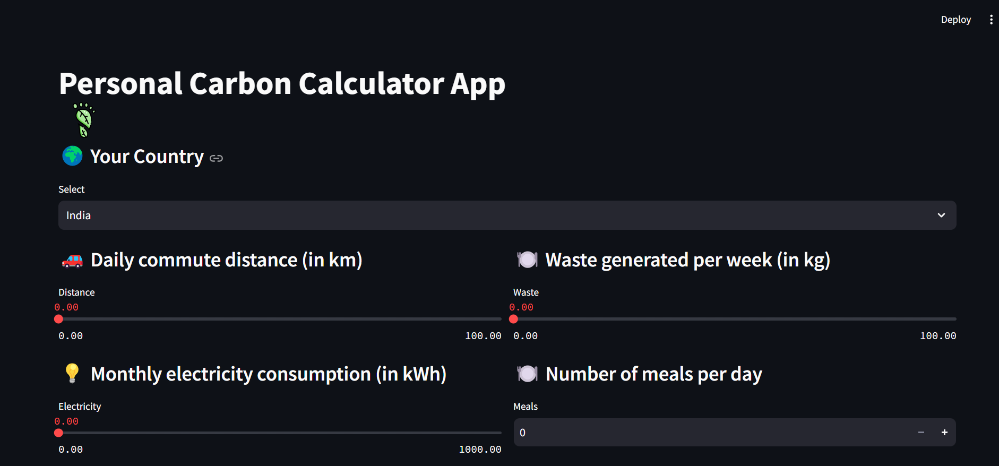

# Carbon Footprint Tracker

**Carbon Footprint Tracker** is a web application designed to calculate and analyze your carbon footprint based on various factors such as daily commute, electricity consumption, diet, and waste generation. This app helps users understand their environmental impact and provides insights into how their carbon emissions compare to global averages.

  <!-- Replace with your project image -->

## Features

- **Country Selection:** Choose your country to get accurate emission factors.
- **Input Metrics:**
  - Daily commute distance
  - Monthly electricity consumption
  - Weekly waste generated
  - Number of meals per day
- **Carbon Emission Calculation:** Calculate and display emissions for transportation, electricity, diet, and waste.
- **Yearly Emission Conversion:** Convert daily and weekly inputs into yearly emissions.
- **Results Display:** View detailed emissions by category and overall carbon footprint.

## Live Demo

You can try out the live version of the EcoFootprint Calculator at the following link:

[EcoFootprint Calculator App](https://ishikacasley14-ecofootprint-calculator-app-pfhoe6.streamlit.app/)

## Installation

To run this application locally, follow these steps:

1. **Clone the Repository:**

    ```bash
    git clone https://github.com/Ishikacasley14/EcoFootprint-Calculator.git
    ```

2. **Navigate to the Project Directory:**

    ```bash
    cd EcoFootprint-Calculator
    ```

3. **Set Up a Virtual Environment:**

    ```bash
    python -m venv venv
    ```

4. **Activate the Virtual Environment:**

    - **Windows:**

        ```bash
        .\venv\Scripts\activate
        ```

    - **macOS/Linux:**

        ```bash
        source venv/bin/activate
        ```

5. **Install Dependencies:**

    ```bash
    pip install -r requirements.txt
    ```

6. **Run the Application:**

    ```bash
    streamlit run app.py
    ```

## Usage

1. **Select Your Country:** Choose your country from the dropdown menu.
2. **Enter Your Data:**
   - Input your daily commute distance (in km).
   - Input your monthly electricity consumption (in kWh).
   - Input the amount of waste you generate per week (in kg).
   - Input the number of meals you consume per day.
3. **Calculate:** Click the "Calculate CO2 Emissions" button to see your results.
4. **Review Results:** The app will display your carbon emissions by category and your total carbon footprint.

## Contributing

Contributions are welcome! To contribute to this project, please follow these steps:

1. **Fork the Repository**
2. **Create a Feature Branch**

    ```bash
    git checkout -b feature/your-feature
    ```

3. **Commit Your Changes**

    ```bash
    git commit -am 'Add new feature'
    ```

4. **Push to the Branch**

    ```bash
    git push origin feature/your-feature
    ```

5. **Create a Pull Request**

## License

This project is licensed under the MIT License. 

### Summary of the MIT License

The MIT License is a permissive free software license that allows you to use, modify, and distribute the software, as long as the original copyright notice and permission notice are included in all copies or substantial portions of the software. The software is provided "as is", without warranty of any kind.

For more detailed information, see the [LICENSE](LICENSE) file.


## Contact

For any questions or feedback, please reach out to:

- **Author:** [Ishika Casley](https://github.com/yishikacasley14)
- **Email:** ishikacasley764@gmail.com
